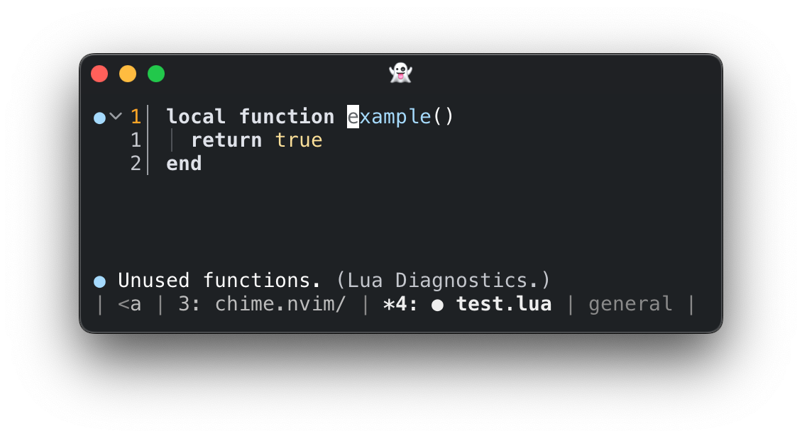

# Chim

Chime is a very little plugin that does a one straightforward thing: it shows
the diagnostic of the current line in the echo / message area.




## Configuration

This plugin aims to do everything _the Neovim way_. Because it handles
diagnostics, it's an [`:h
diagnostic-handler`](https://neovim.io/doc/user/diagnostic.html#_handlers).
This means configuration is handled using `vim.diagnostic.config()`, **not**
`setup()`. It also listens to global configuration options for diagnostic
handlers, and you can enable it only for certain namespaces. See [`:h
vim.diagnostic.config()`](https://neovim.io/doc/user/diagnostic.html#vim.diagnostic.config())
for more info.

```lua
vim.diagnostic.config({
  chime = {
    severity_sort = false,
    severity = nil,
    format = ...,
  }
})
```

Chime can be enabled or disabled on the fly:

```vim
" disable Chime
:lua vim.diagnostic.config({ chime = false })
" and enable again
:lua vim.diagnostic.config({ chime = true })
```

## Format

Set the format of the diagnostic message with the `format` config option. It
should be a value that receives a diagnostic and outputs either a string,
echoed as-is to message area, or a list of colored chunks (like the first
argument of `vim.api.nvim_echo()`.

An example that returns the formatted string `[E] Unused local. (luals)`:

```lua
vim.diagnostic.config({
  chime = {
    format = function(diagnostic)
      return ('[%s] %s (%s)'):format(
        -- this assumes the default sign text
        vim.diagnostic.config().signs.text[diagnostic.severity],
        diagnostic.message,
        diagnostic.source,
      )
    end
  }
})
```

And the same diagnostic but with the sign text highlighted in its color and the
source in gray:

```lua
vim.diagnostic.config({
  chime = {
    format = function(diagnostic)
      local signs = vim.diagnostic.config().signs
      local colors = {
        'DiagnosticError',
        'DiagnosticWarn',
        'DiagnosticInfo',
        'DiagnosticHint',
      }
      return {
        { '[' },
        { signs.text[diagnostic.severity], colors[diagnostic.severity] },
        { '] ' },
        { diagnostic.message },
        { ' (' },
        { diagnostic.source, "NvimDarkGray2" },
        { ')' },
      }
    end
  }
})
```

## Severity

The severity filter. See `:h diagnostic-severity`.
